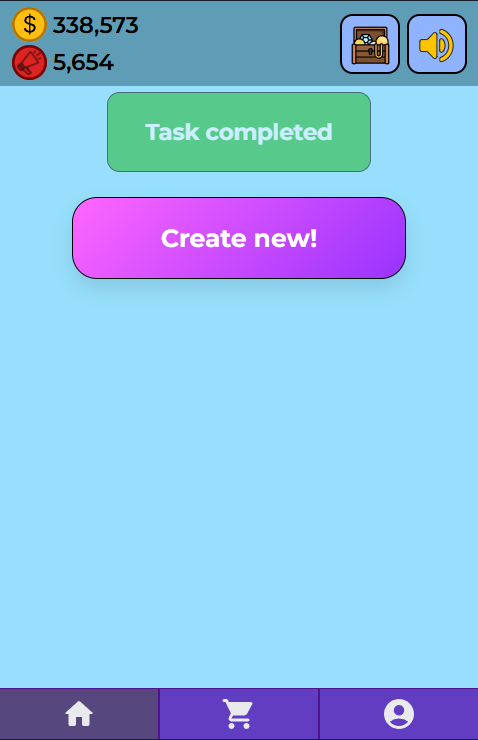
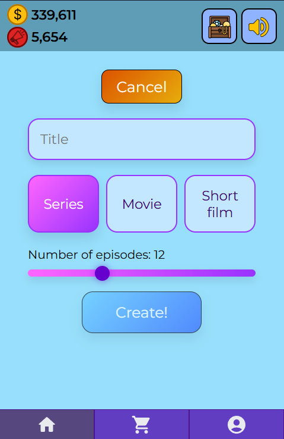
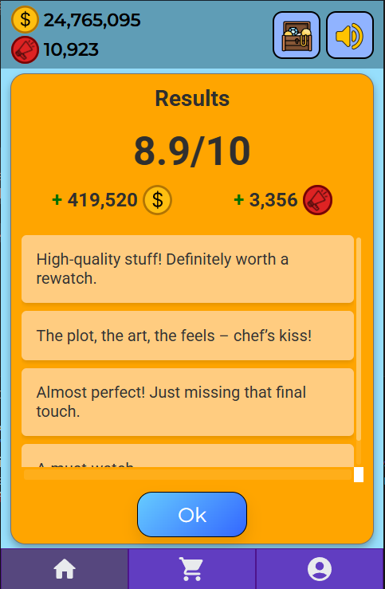
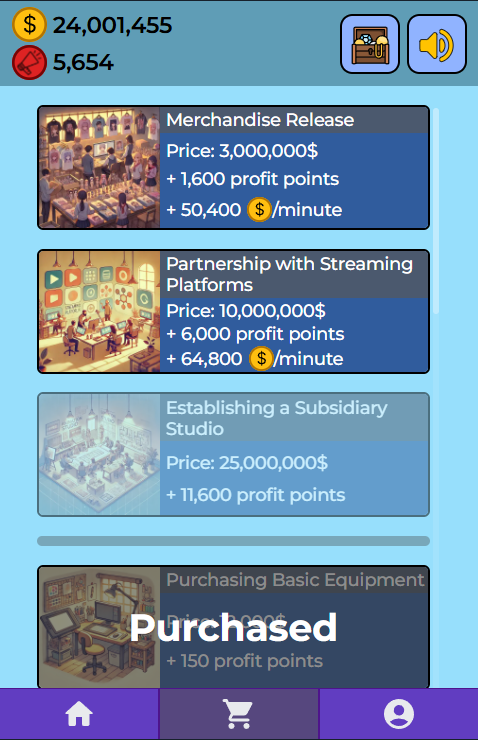
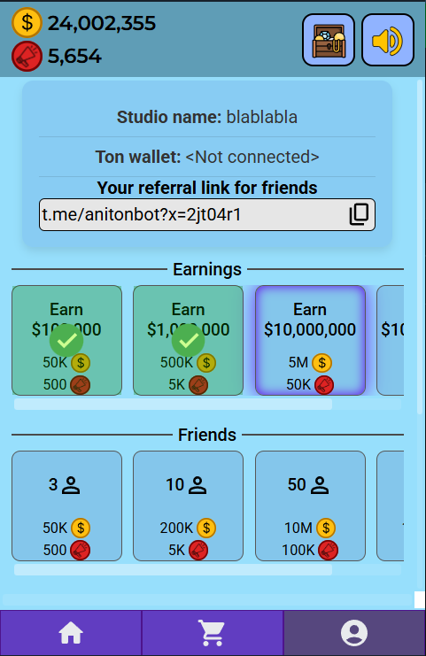
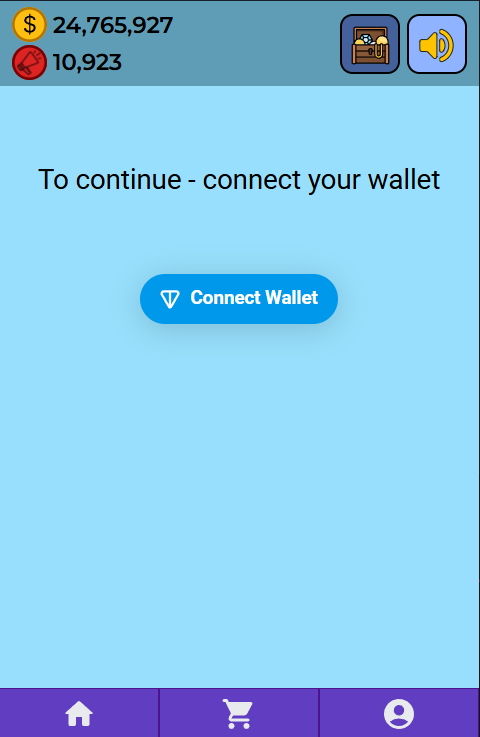

# Aniton

A Telegram Mini App game.

## Tech Stack

| Area           | Technologies                                                |
| -------------- | ----------------------------------------------------------- |
| Frontend       | React 18, Vite                                              |
| Backend        | Django (Python 3.10)                                        |
| Database       | MySQL 8, Redis 7                                            |
| Infrastructure | Docker, Docker Compose, nginx,                              |

## Screenshots

<p align="center">
  
  
  
</p>

<p align="center">
  
  
  
</p>


## Quick Start (Local)

### Backend

```bash
cd backend
pip install -r requirements.txt
cd aniton
python manage.py migrate
python manage.py runserver 0.0.0.0:8000
```

### Frontend

```bash
cd frontend
npm install
npm run dev
```

## Production Deployment

```
1) create and edit .env.prod file
2) get ssl certificate
docker compose run --rm certbot certonly --webroot \
  --webroot-path=/var/www/certbot \
  --email <email> --agree-tos --no-eff-email \
  -d <domain> -d <...>
3) edit nginx/default.conf
4) create and edit .env.prod file
5) docker compose --env-file .env.prod build
6) docker compose up -d
```

## License
Licensed under the MIT License. See the [LICENSE](LICENSE.md) file for details.
